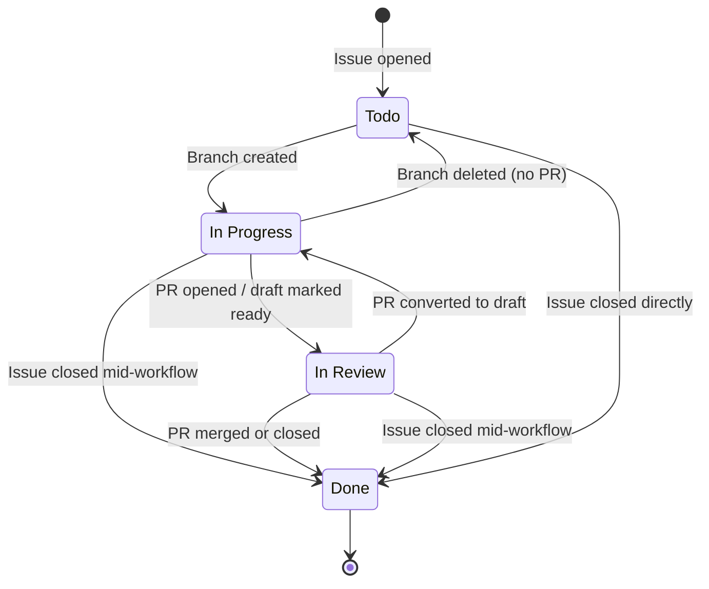

# Speakify

## User Guide

### How to Work on a Task

1. **Create an issue** describing the work (auto-added to board as **Todo**, assigned to you)
2. **Create a branch** with the issue number in the name:
   ```
   42-add-login-page
   feature/42-add-login
   fix/42-bug
   issue-42
   ```
   The issue moves to **In Progress** automatically.

3. **Open a PR** and link the issue in the description:
   ```
   Closes #42
   ```
   The issue moves to **In Review** and is assigned to you.

4. **Merge the PR** — the issue moves to **Done** and closes automatically.

### Rules

- **One PR per issue.** Duplicate PRs are auto-closed.
- **Don't reopen issues or PRs.** They will be auto-closed. Create a new issue instead.
- **Reviews are advisory.** "Request Changes" won't block merges — use comments for feedback.
- **Use draft PRs** if you're not ready for review. The card stays in "In Progress" until you mark it ready.
- **Always link an issue.** PRs without a linked issue get a reminder comment.

---

### Workflow State Diagram



